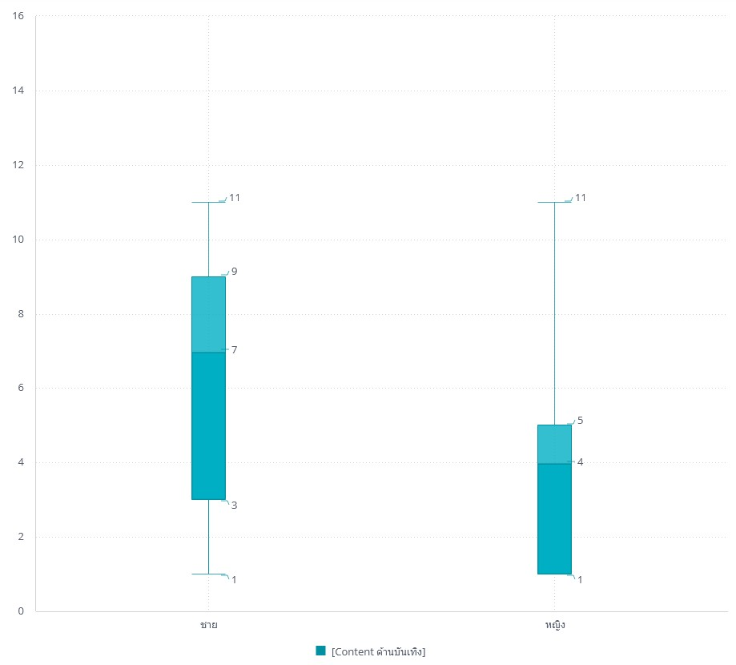
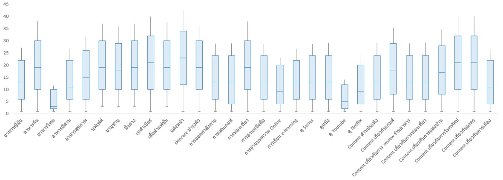
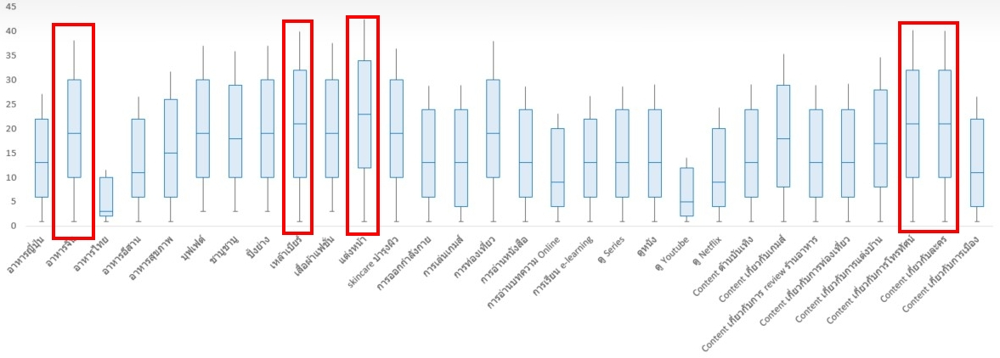
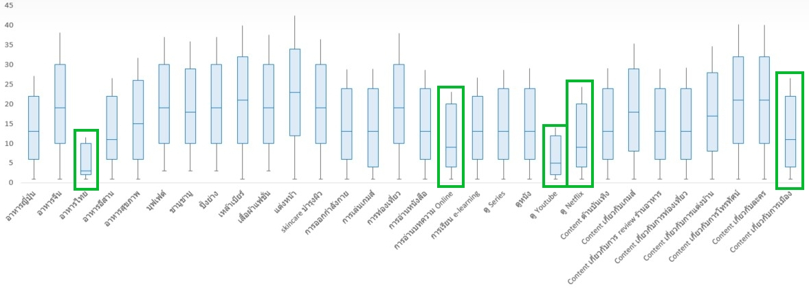

<h1>The FOMO of hanging out</h1>

From the class videos, this topic was looked at from the topic perspective as in if the boy A like item 001 then what else does he likes. There was the perspective of birthday which takes look at this point a zodiac point of view.

<h3> The Fear of Missing Out</h3>
Naturally, every once in a while, you will have to make a choice which activities you want to go to because the schedule will clash. Should you go to that Thai dinner place if your friends are going again tomorrow? Or should you be going to that one concert because it is an once a year occasion?
Assuming all your friends are equally important. This perspective should offer a "rarity" rating on each of the activities. 

<h2> Data Prep </h2>

Comes in Excel, deal with it in Excel.
So now that we got our goal, our main concerns should be about how frequent does this specific activity occurs?

First step first, I remove "คุณบริโภคสิ่งเหล่านี้บ่อยขนาดไหน" from the Title since I already know what I am up against.
Then, we use manual encoding of frequency but rather than the usual hot encoding, the scoring based on the rarity of frequency should do a better job as we can straight up do a Box Plot of the data.

Since the less frequent the activity, the higher priority it should have. The encoding are as followed
<ul>
  <li>แทบทุกวัน: 1</li>
  <li>อาทิตย์ละครั้ง : 3</li>
  <li>เดือนละ 2-3 ครั้ง : 5 </li>
  <li>เดือนละครั้ง : 7 </li>
  <li>หลายเดือนครั้ง : 9</li>
  <li>แทบไม่ได้บริโภคเลย : 11</li>
</ul>

When graphed, the data for each variable should look similar to this,

 I know I violated the rule of "Comes in Excel, deal with it in Excel here but I'll fix that right up

Based on this graph alone, if your friends happened to be a guy and asked you to hang out with Entertainment Biz kind of theme, you should say yes since the median score of said activities are around only once a month. Compared to when most of your freinds are female, this is like once a week thing, pushing it off to next week should be fine.

Once we do that with all of our activities, we get this

So from all this, what should you make priorities for?

Look friend, if there was a situation where your friends ask you to grab a drink at a Chinese restaurant while catching up on the latest movies and anime, take it.
Because from the data here, and the Homework 3 data about how we spend our free time. Stats students, at least in this class, we dont have that much free time for a pint or two.

Then what about those activities that you can make time for and keep pushing them off with feeling guilty about?

Local food, Netflix, Politics, and Research papers. Yeah we are definitely indoor people here.
