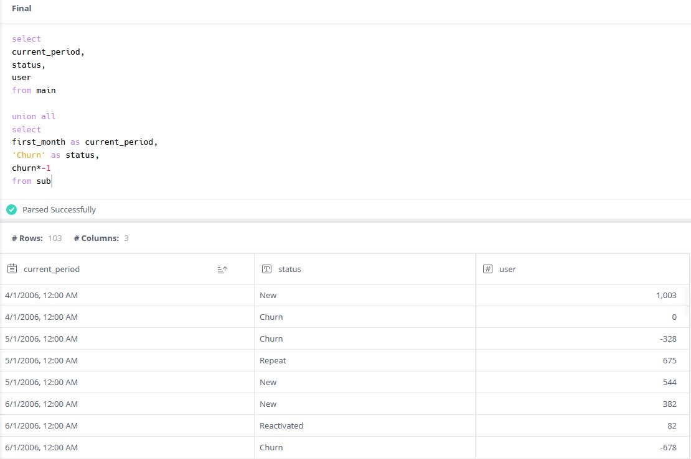
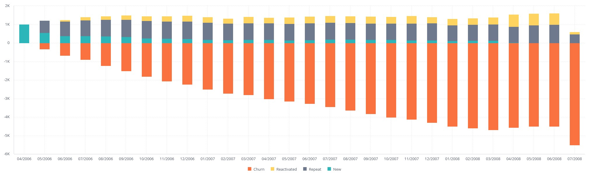
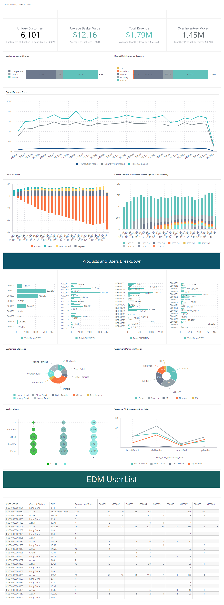

<p><h1>Customer Movement using SQL</h1>

```
select
current_period,
status,
count(CUST_CODE) as user
from

(select
CUST_CODE,
past_period,
prev_period,
current_period,
case 
when prev_period is null and past_period is null then 'New'
when current_period = DATE_ADD(prev_period, INTERVAL 1 MONTH) and past_period is null then 'Repeat'
when current_period = DATE_ADD(prev_period, INTERVAL 1 MONTH) and prev_period = DATE_ADD(past_period, INTERVAL 1 MONTH) then 'Repeat'
when current_period <> DATE_ADD(prev_period, INTERVAL 1 MONTH) then 'Reactivated'
when current_period <> DATE_ADD(prev_period, INTERVAL 1 MONTH) and prev_period <> DATE_ADD(past_period, INTERVAL 1 MONTH) then 'Reactivated'
when current_period = DATE_ADD(prev_period, INTERVAL 1 MONTH) then 'Repeat'
else 'casing' end as status
from
(select
CUST_CODE,
lag(new_date,2) OVER(Partition by CUST_CODE ORDER BY new_date ASC) AS past_period,
lag(new_date,1) OVER(Partition by CUST_CODE ORDER BY new_date ASC) AS prev_period,
new_date as current_period
from

(SELECT 
CUST_CODE,
PARSE_DATE('%m/%d/%Y',  CAST(concat(Substring(cast(shop_date as String),5,2),'/','01','/',left(cast(SHOP_DATE as String),4)) as String)) as new_date,
count(distinct left(cast(shop_date as String),6)) as Occurence
FROM `bads-customer-analytics.supermarket_class.supermarket`
Group by 1,2)
as a))

group by 1,2
order by current_period  asc 
```

Notice that the Churn rate is missing. This is because I will be relying on summing up all of the New users each month as a running sum and deducting all other statuses later on within the BI engine.

<i> (Running sum of New - Sum of All statuses) *-1 = Churn </i>

<br>
Once merge using union, the final table in the cube should look similar to this
<p align="center"></p>
</p>

Once done, you should have something looking like this
<p align="center"></p>

Which is a subset of CLV Dashboard
<p align="center"></p>
