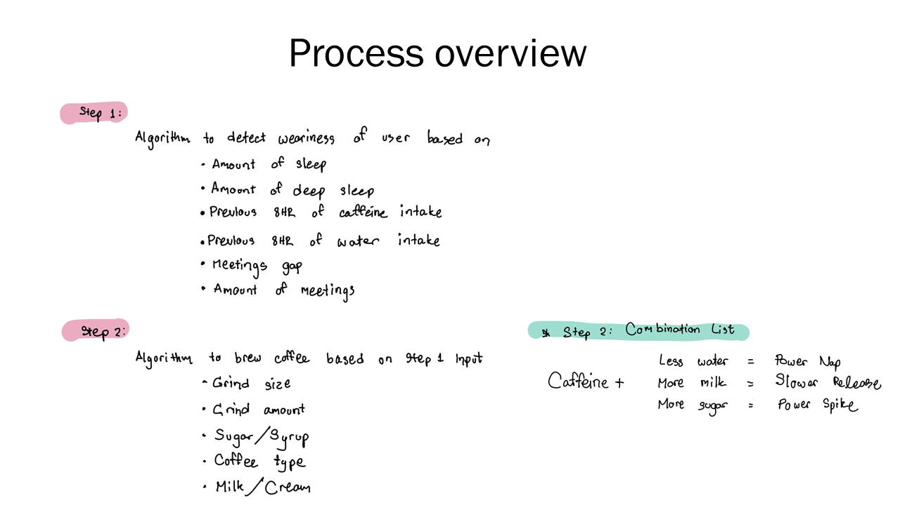
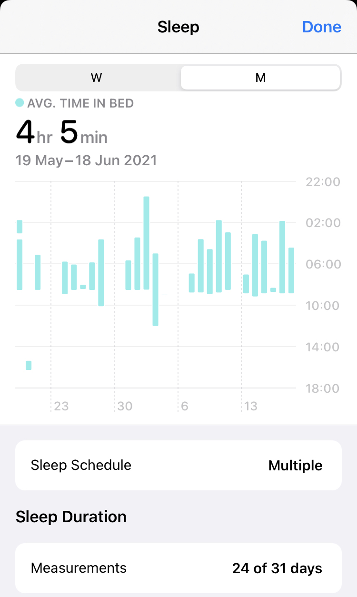
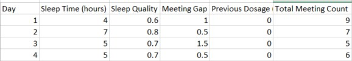
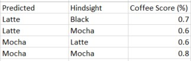
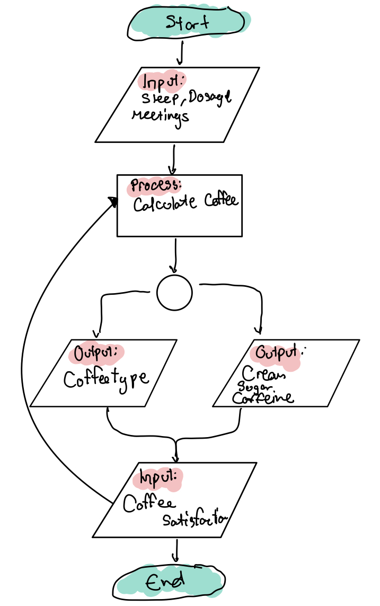

<h1> Design Thinking - What coffee do you want?</h1>
But actually, what coffee does your body needs right now?

So Imagine this, It's Monday 08:50AM. You played game until 3:00AM last night. You have a meeting at 09:15AM which you have to lead the Q&A session, something about the calculation of your model were not what you were expecting. You couldnt remember the details right now. The birds are chirpping the sound of the nearby market are getting livelier and livelier but all you can feel in your soul right now is the drowsiness blessed by the Sandman himself.

You need the miracle potion. You need it now. You opened a cabinet that then comes the million of capsule options at your displosal yet your just stood there. Motionless. Welcome to Schwartz Paradox of Choice. The meeting starts in 4 minutes. It's now or never. So you did what any responsible adult will do and that is to grab the brightest color that caught your eyes and pop them into your coffee machine. Arabica, I guarantee you because red is the brightest color in that cabinet. Now you're still there in a meeting room, wide awake, answering all the questions they throw at you. Once the meeting ended, you are left to yourself with a question, why do I hate this coffee so much? Yet here it is, I picked this.

If you've ever found yourself in this situation. Please join the club, I'll be sending you our Discord server.
  On to serious talk, the product I'm suggesting comes of the Paradox of Choice situation and the most effective way to deal with it when we are mentally unable to in the morning.

  
  
<h2> The breakdown </h2>
  

  
  A great and delicious coffee is about many things but the need coffee is about 3 things
  <ul>
    <li>Caffeine</li>
    <li>Milk/Cream</li>
    <li>Sweeteners</li>
  </ul>
  
  To get all that just right, we break down our needs into 2 elements; The Body and The Coffee.
  
  <h3> The Body - Step 1 </h3>
  The body's needs is about how much you have to endure during the day. So these things are based on the lists in the step 1 being tallied up and present it to the model.
  <h3> The Coffee - Step 2 </h3>
  It is basically a constraint output which then get the feedback from the input method of the previous step.
  
  

  
 The basic thing we need was the sleep time of our users, and see how strong of a dosage they need to stay awake during the day.
 
 This steps right here is the input as well as the feedback loop of our model.

  

<h2>Actual Run</h2>

I got the data for just about a week. The hindsight score is, at the end of the day, the user actually give their coffee some thought and decided what they would rather have in the morning, heance, the hindsight. This serves as a feedback loop into the system. Then the user also note down the coffee score based on what they actually had in the morning.

Over time, the model should learn the preference of the users to achieve the highest precision when it comes to coffee type, while tweaking The Coffee element such as the sweetener, milk/cream amount to achieve the highest score taking into account the various inputs from activity band and smart phone. 

<h2> Flowcharts </h2>
In the end, it should be straight forward like so

