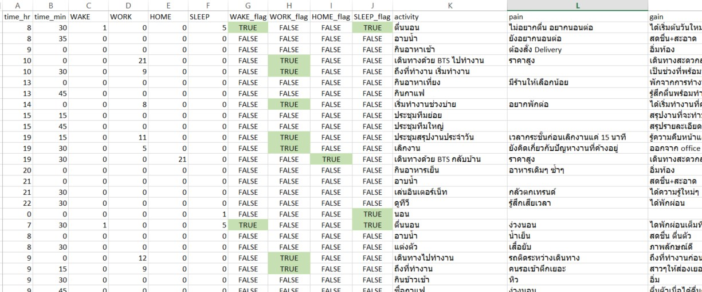
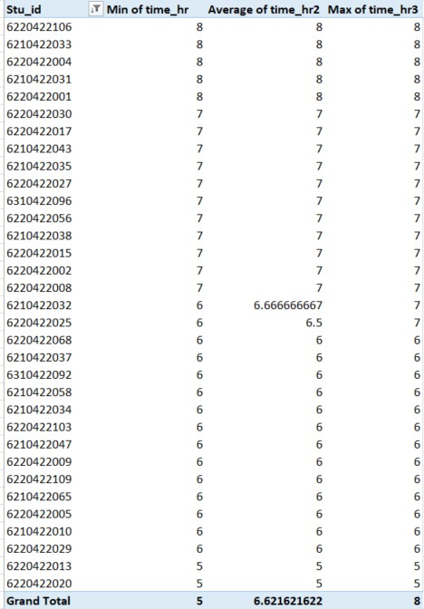

<h1> A Day in Life</h1>

Big thanks to P'Jump. I'll be using data from his compilation in the shared folder (Full name in the description of this Excel file).

<h2> The Approach</h2>
The way I looked at this data after skimming through the data is
<ul>
  <li> Data students are united through passion for food </li>
  <li> We are all workaholics (Cant say the same about school's work though) </li>
  <li> There is rarely anything we do for fun, there is only relaxation. We're all getting old </li>
</ul>

So what's missing during the weekday? The <b>"fun"</b> part.

<h2> The Data Prep</h2>
It comes in Excel then I'll deal with this in Excel.
The day will be broken down into 4 period; Wake,Work,Home,Sleep.
What I am looking for is the personal cooldown period of each student between the <b>"Home/Off work"</b> and <b>"Sleep"</b>

<h2> Data Prep Part 1/ Standardizations of Activities</h2>
I'll be using ตื่น, งาน, บ้าน/เลิก, นอน as the main cateogries.
The Excel formula I'll using are mainly in the format of

<i> =IFERROR(FIND("ตื่น",$G2),0) </i>

There are some that use ตื่น + นอน as wake category, I've taken care of this issue using
 <i>=IFERROR(FIND("ตื่น",$G2),0)</i> for wake
 <i>=IFERROR(FIND("ตื่น",$G2),0) < 1 AND =IFERROR(FIND("นอน",$G2),0) > 1 </i> for sleep
  
Basically I prioritized the wake category first and sleep category second.

There are also discrepencies for "Work" category as some people put details into their travel such as leaving for work, reached the workplace, started working.
  
What I did here is I take the <i>min(time start)</i> of work category since the moment the thought of work comes into your mind, the work starts and the relaxation ends. I also did similar thing with "Home/Off work"
  
I've also changed the midnight time from 0:00 to 24:00 to get easier management out of sleep hours and waking hours. I also added in condition of
 <i>=IFERROR(FIND("ตื่น",$G2),0) > 0 AND time_hr < 3 THEN time_hr+24</i>
To which, if calculated out to more than 24 in the end, I can deduct 24 out to get the real hour of sleep.
  
Then there are some people that has incomplete activities such as their day only consists of work with no wake or sleep. I excluded this data through the use of flag and <i>VLOOKUP</i>
  
After all the keywords are searched for, we create additional column of boolean flag in order to make our Pivot easier.

Then we proceed to use Pivot to gain the min/max/average time on each of our categories.

<h2> Results</h2>

So after Pivot, we'll get something along the line of this format for each activities

With this we now know that:
<ul>
  <li> Most people wakes up at around 7:00 </li>
  <li> Starts work at 8:30 </li>
  <li> Gets off work at 17:00 </li>
  <li> The majority of students work for 9 hours with around one-third racking in 11 hours work day </li>
  <li> Reaching Home just before 19:00 </li>
  <li> Finally Sleeping in at 00:30 </li>
  <li><b> Meaning we have 5 hours to ourselves each day </b></li>
</ul>
  
From our initial stage of results here, I can drill down the pain and gain of leisure activities to between 19:00 to 00:30, coupling that with the boolean flag, I've set earlier and we should have a complete picture out of this Excel. 

  

<h2> Data Prep Part 2</h2>

In this part, I will Pivot the activities to take out the necessities such as shower, just got home, homework, and sleep for those that sleep early and got through the filters in the initial stage of results.
I didnt take out the dinner bits because it seems, we are all passionate about food from the preliminary data read through.
The work flows are still the variations of
 <i>=IFERROR(FIND("XXX",$G2),0)</i> for activities

As for the keywords for elimination, they are อาบน้ำ, การบ้าน, ถึงบ้าน, นอน.

Then new key is created using Activities|Stu_id to remove duplicates which will lead to pains and gains analysis.
