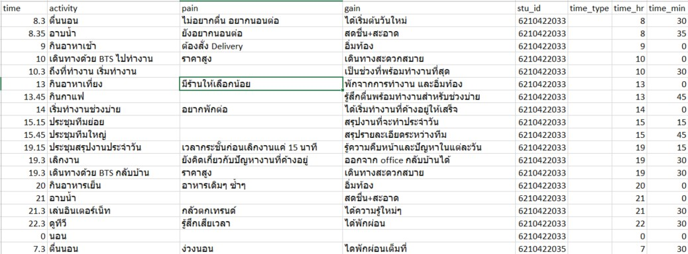
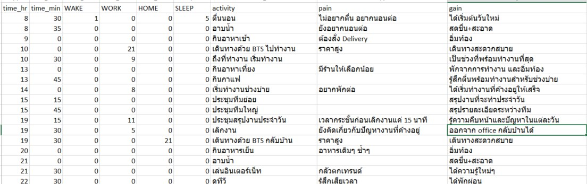

<h1> A Day in Life</h1>

Big thanks to P'Jump. I'll be using data from his compilation in the shared folder (Full name in the description of this Excel file).

<h2> The Approach</h2>
The way I looked at this data after skimming through the data is
<ul>
  <li> Data students are united through passion for food </li>
  <li> We are all workaholics (Cant say the same about school's work though) </li>
  <li> There is rarely anything we do for fun, there is only relaxation. We're all getting old </li>
</ul>

So what's missing during the weekday? The <b>"fun"</b> part.

<h2> The Data Prep</h2>
It comes in Excel then I'll deal with this in Excel.
The day will be broken down into 4 period; Wake,Work,Home,Sleep.
What I am looking for is the personal cooldown period of each student between the <b>"Home/Off work"</b> and <b>"Sleep"</b>

<h2> Data Prep/ Standardizations of Activities</h2>
I'll be using ตื่น, งาน, บ้าน/เลิก, นอน as the main cateogries
The Excel formula I'll using are mainly in the format of

<i> =IFERROR(FIND("ตื่น",$G2),0) </i>

There are some that use ตื่น + นอน as wake category, I've taken care of this issue using
 <i>=IFERROR(FIND("ตื่น",$G2),0)</i> for wake
 <i>=IFERROR(FIND("ตื่น",$G2),0) < 1 AND =IFERROR(FIND("นอน",$G2),0) > 1 </i> for sleep
  
Basically I prioritized the wake category first and sleep category second.

There are also discrepencies for "Work" category as some people put details into their travel such as leaving for work, reached the workplace, started working.
  
What I did here is I take the <i>min(time start)</i> of work category since the moment the thought of work comes into your mind, the work starts and the relaxation ends. I also did similar thing with "Home/Off work"

