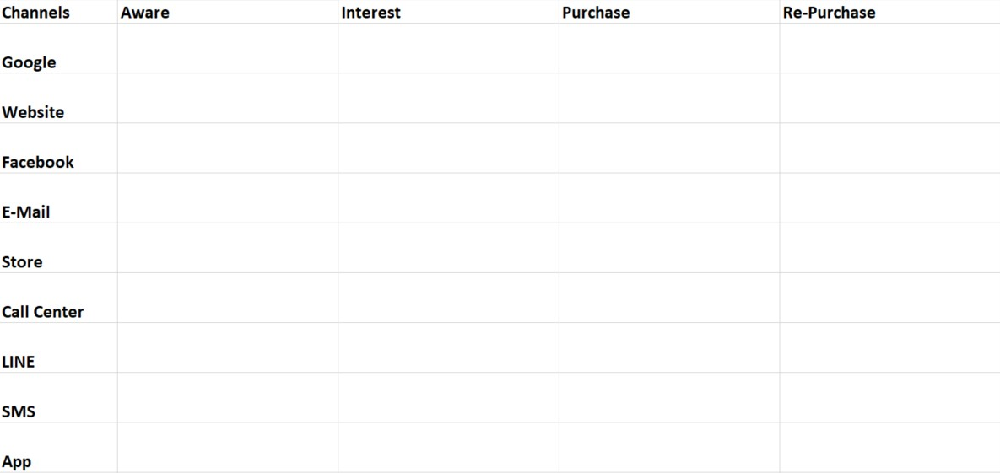
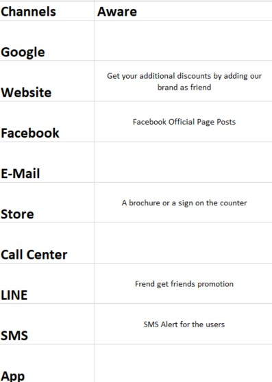
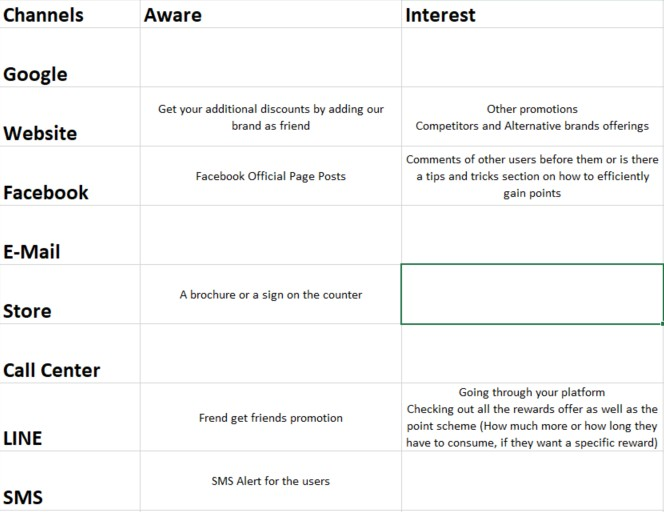
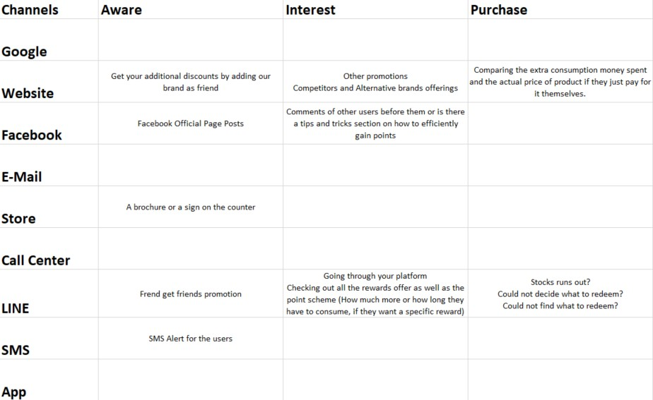
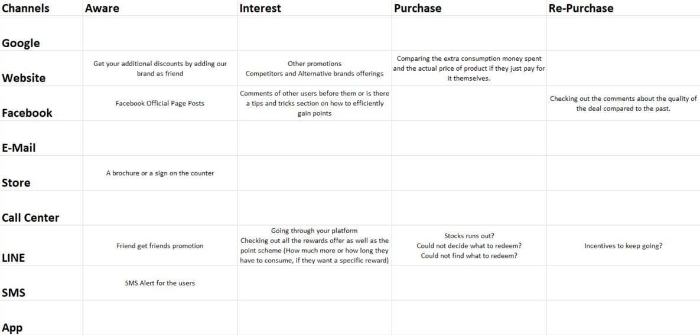
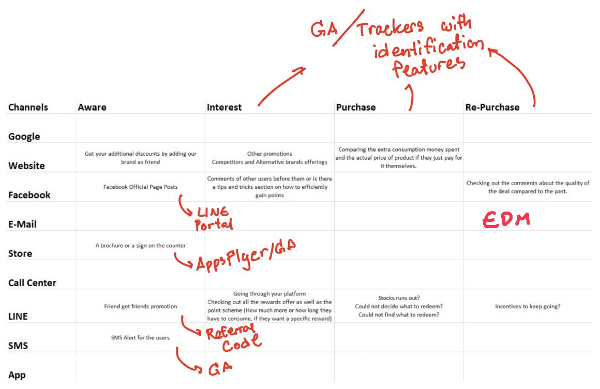

<h1>About the Customer Journey thing</h1>
 Let's start with the empty Canvas.
  

 

You've probably seen this before in class, people usually linked this with the ecommerce and the data collection often ends up with Google Analytics, but today I'll try to go into it from the Loyalty Platform perspective.

Lets go over the <b>Channels</b>. 

You'll see that there are 3 additionals channels added to the default canvas; LINE,SMS, Native App.  

<h2>AWARE</h2>
The Loyalty Platform ways of generating awareness often relies on those that are "in the know", so you know, the existing customers. These people already liked and followed the Official Facebook page of the product, consume the product on a regular basis (Their own regular basis and not sales team's regular basis), or are already targeted by the brand through retargeting on Lazada or Shopee.
The trend we're currently seeing in the Thailand's Loyalty Platform market is through the Official LINE Channel. To the brands, LINE is relatively cheap (compared to native app), low barrier to entry (everyone's grandmas know how to use this), and the platform is simple enough that a small team can manage without relying heavily on IT. 

 So our awareness should look something like this 

<h2>INTEREST</h2>
For the Loyalty Platform, we can kind of skip over the Googling to find information part since the goal of the platform, usally in the first phase, is to engage, reward, retain, and get to know the existing customers anyway.

<h3> First stage of interest </h3>

The initial hurdle for the brand starts here. There's a dilemma, the brand wants to gather just enough information at the registration stage to do their segmentation and confirm that these users are indeed your customers (Not just some randoms that will take get free rewards and leave) all the while makes it short enough that they dont scare aware the LINE followers.

<h3> Second stage of interest </h3>

Then comes the platform interactions. You can have as many features as you want, you can have the greatest content of all time, but if your site flows horribly then it doesnt matter. Your users (Now committed, registered, and took your welcome rewards) will never find them and will not see value in them.

This is the part where your users users go through your app giving you about 5 minutes (give or take, max I've seen recently is 10 minutes) to show off all your benefits so that they can decide if they will stay, participate, redeem, and consume more of your rewards for those juicy rewards.

If your users decided to stay after first session, congratulation! Your golden 3 months period starts now.
 Before I go into purchase/redeem, let's check our that graph

<h2>Purchase/Redeem</h2>
What makes Loyalty platform more difficult than e-commerce platform is the <b> Four non-impulsive decision making steps</b> that each customers will have to go through to get the most out of the loyalty platform.

Welcome, to <b>The GRIND</b>
 
 <ol>
  <li>They have to decide to buy the product</li>
  <li>They have to remember that there's a brand platform</li>
  <li>They have to keep the packaging of that product and fill in the codes for points</li>
  <li>They have to want the rewards enough to keep repeating step 2 and 3 over and over</li>
</ol> 
 

The trick here is to finds out just how much each user normally consumes and set the rewards just above that threshold in a sensible time frame. 

So let's say
-> Timmy eats 4 packs of chips per week 
-> Timmy wants a voucher for beer 
-> Brand finds a voucher that's worth around a month of Timmy's normal consumption plus 10%

Now Timmy does not feel pressured by the consumption goal and feel that the reward he wants is attainable.
 <b>The goal of the brand is to push that ATTAINABLE feeling in the users</b> 

Too low and the brand lose out on sales and lose out on the money spent on too many rewards.
Too high and the users leave.
Balance this, coupled with strong marketing, and you should be good for a long haul.

Now to the graph:

<h2>REPURCHASE</h2>

Congratuations! 50% of those that made 1st redeem/purchase will do it the 2nd time without the brand having to pour as much into promotions.
The <b> Four non-impulsive decision making steps </b> are still ongoing but now, at least part 2 and 3 are a part of their daily/weekly routine.

The decisions that brand will have to make here are the blancing act of keeping the rewards interesting while keeping what each client wants avialable. It does not have to be the same product but the brand needs to know what these purchased customers preferred.

The brand also have to come up with new campaign to keep things engaging. The terrible thing about the Official channel other than Facebook is that they alerted the consumers. It's a double edge sword. On one hand, the engaging users would love to know if there are any new info, new promotions, new things to redeem. Then there are also users who are on the fence about leaving and one wrong move here results in the deletion of app or instant block in notifications.

Reactivation campaigns are needed but must be carefully utilized.
 

<h1>THE TOOLS</h1>

Let me break it down like so

Like I said earlier, the most trending channel for Loyalty Platform is currently LINE, so the measurement of our success relies on data from the LINE portal which provides 
<h3>LINE PORTAL</h3>
<ul>
  <li>Followers count</li>
  <li>Block Rate</li>
  <li>Content response rate</li>
  <li>Exploratory data on followers profile</li>
</ul>

<h3>Google Analytics(GA)</h3>
The bare minimum of gathering the interest of the users. Loyalty platforms focusing on redeem transactions often relied on the redemption data and forget that redemption does not necessarily means that the rewards are what the user truely wants. It is what they want the most out of the resource they have available (points).
With GA, we can see what the user considered to be viable rewards before committing their points.
<ul>
  <li>Behavior Flow (How the users navigate the platform)</li>
  <li>Time spent on each page (Is 30 seconds really enough for looking through all the rewards catalogue?)</li>
  <li>What are their options (Back and Forth pageview data)</li>
  <li>Bounce Rate, Exit Rate</li>
</ul>

<h3>EDM</h3>
After knowing all that, you need ways to communicate or remind the users that your platform still has a lot to offer if they keep participating or may be remind them to come back because you finally have a deal that they wont find elsewhere. May be you finally figured them out and decided to send out a <b> Holygrail of modern data driven marketing hype : Hyperpersonalized messages </b> Insert Hello, Timmy here.

To do all that, you need EDM. 
A good EDM enables the brand to communicate to a specific group of users through customized Text messages. A great EDM enables the brand to communicate using customized messages that fits the user preference after testing it through A/B testing and track their performance as well.

<h3> More than Google Analytics</h3>
The last tool is what most of the Loyalty platform are after. Some bought them, some developed them inhouse but the goal is the same.
It is a Google Analytics that can linked each and every users back to your database of customers.
The hyperpersonalization stage of layouts, of artwork A/B testings, of welcome messages when the user open the platform starts here.
The data to be gained are massive.
Hotjar is one.

<h2>Final Note</h2>
Retention Rates are what the brands are after, I mean acquisition cost are often more expensive that the cost of feeding them promotions right? And loyalty platform are what's hot right now due to the reach of internet and the CoVid quarantine keeping us all indoors. Online presence surges and so are the likely hood of information overload.
Each brand has to come up with their own ways to talk to their customers and keeping them engage as long as possible.
As a customer, we have a lot more options now. So weighting the opportunity cost is as simple as Googling the brand name. There's no more need to feel dissatified and stuck with a brand you dont believe in.
