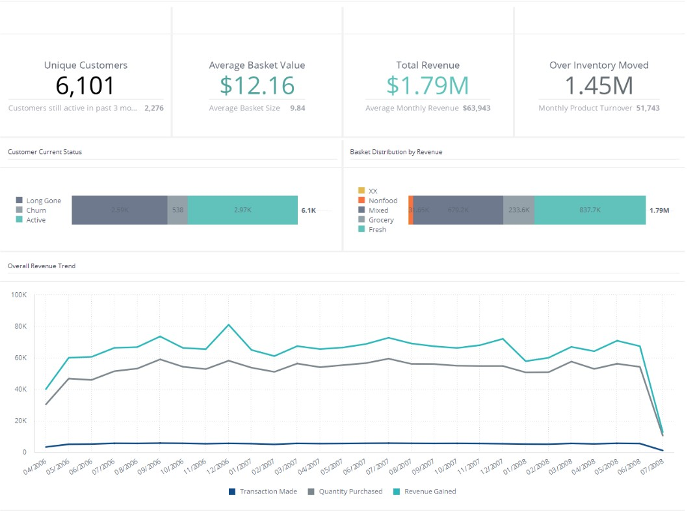
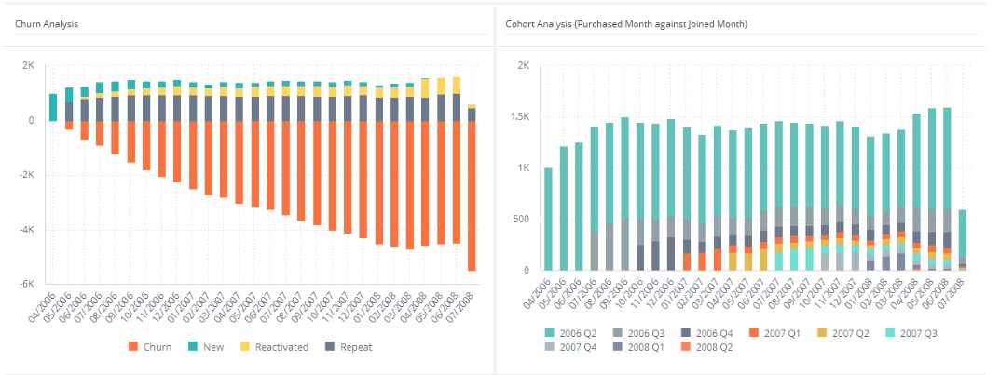
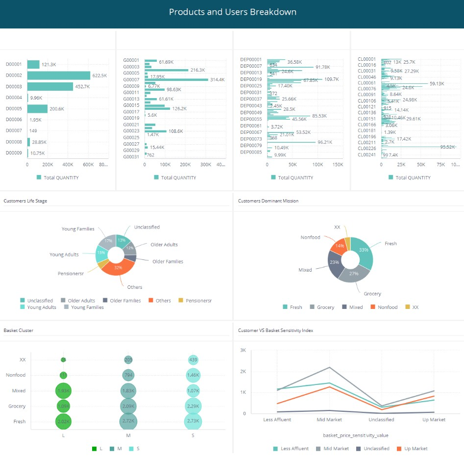
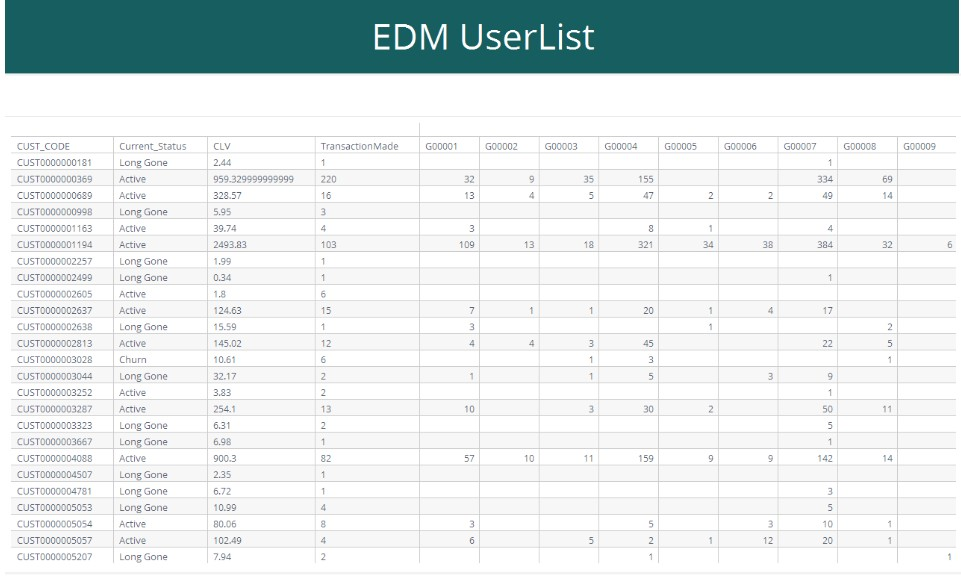
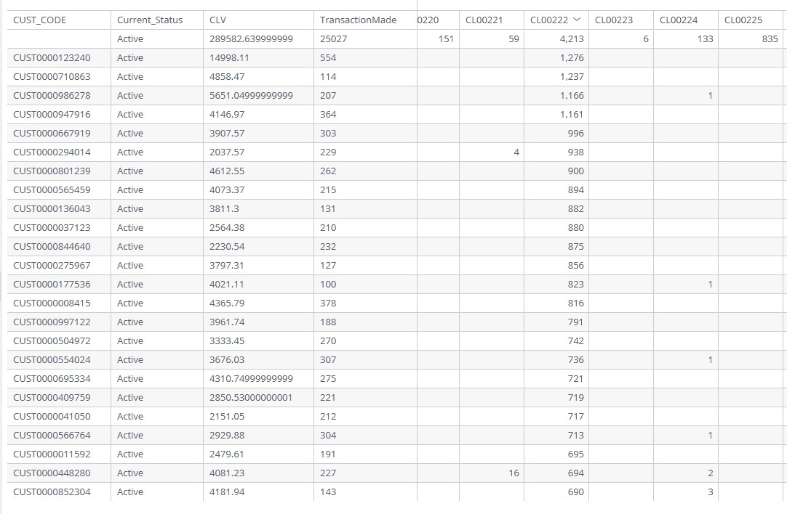
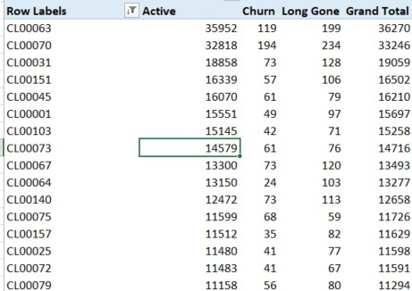

<h1>CLV Dashboard</h1>

The CLV is about tracking your customers and use that to predict the overall health of your business.
There are some KPI such as CLV (Sum of all money spent), Average Basket Size, Average Ticket Size, and the Churn rate.

The all in one dashboard should be able to track all these KPI, view the product purchased for recommendations, view the demographics of the customers, and sent out notifications or brochure or relevant information in each segments all in one.

The dashboard should be interactive in all their elements to be able to used as filters.

<h2> Overall Shop Health </h2>

Here the readers can glimpse through the current statuses of the shop through easy to read indicators.
The customers current status shown the overall health of the buyers, to see if they are actively shopping at our shops or are they long gone.

I used 3 months as a reference point since from my personal experiences, if the customers are not back at least once within 3 months, they are definitely churned.

Then there are 2 levels of churn; Churn and Long gone. The long gone customers are the one that didnt come back even once in the past 6 months.

The calculation of this metrics are
 <i> Monthdiff(Date(), Max(Shop_date) </i> 

There are also overall trend to show the performance compared to past period. The graph can be broken down to the daily level to answer the needs of flash sales and special daily promotions KPI measurements.

<h2> Overall Customers Health </h2>

For this part rather than the normal churn analysis to look at the movement of the customers, we need to know what type of customers stuck with us so that we can replicate the acquisition process and use their demographics as a benchmark for future campaigns

The Churn are about how many we lost along the way but the Cohort Analysis right next to it. I choose to plot current purchasing month against the first purchase month (or joined month) of the customers.

Here we can clearly sees that whatever we did to acquire the buyers during Quarter 2 of 2006 were definitely working and should be replicated. The customers should be surveyed and learned preferences from. 

<h2> Products and Users Breakdown </h2>

For this part, we will look into the products preference of each users segment. Every single part chart works as a filter that once clicked should show the segment that purchased that as well as drill down to the next product's level.

There is also the clustering of Basket and Sensitivity Index. 
Here we can see that the Mid Brackets are the one that are the most difficult to please and they are the most finicky of the bunch where they rank very high relative to others in term of their wallet and the product's discount. 

<h2> The EDM UserList </h2>

The user list shows the overall summary of each users plotted against their past purchases (unless you select the date).
The information is broken down into individual level so that the dashboard users and the shop owner and instantly remedied and target the interested target segments of choice.

Since the table also broke down to the product's level, this table can also be used in product's recommendation.

<h2> Product's Recommendation Through Dashboard </h2>

Imagine you wanting to know the profile of the users that purchased a specific product, say <i>CL00222</i>. By selecting the SKU in the dashboard you see the following information

Once exported, you can Pivot the achieve this result

