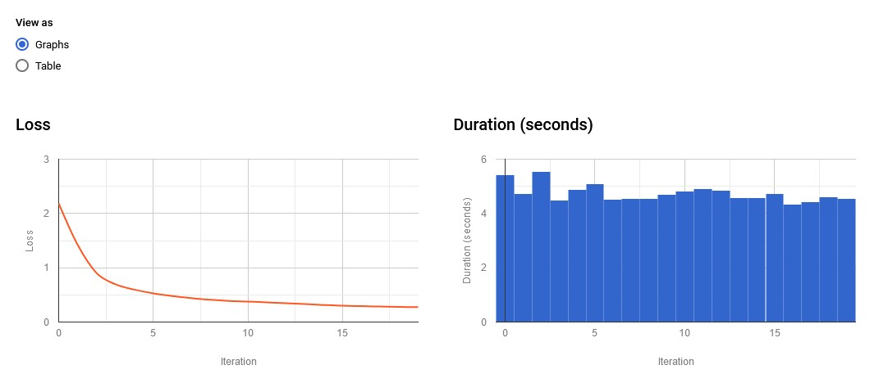
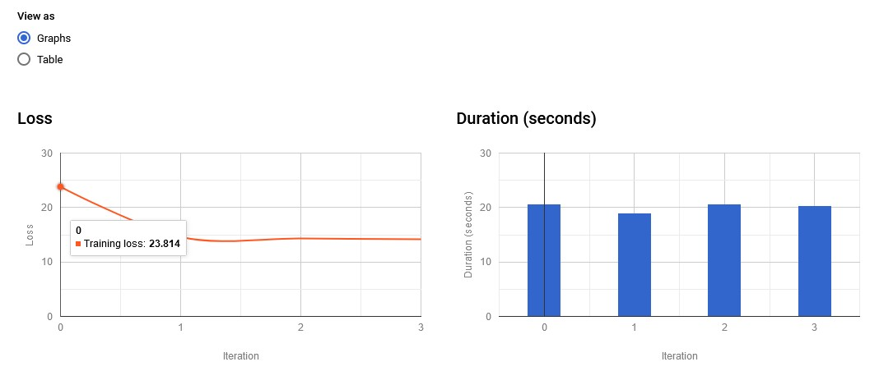
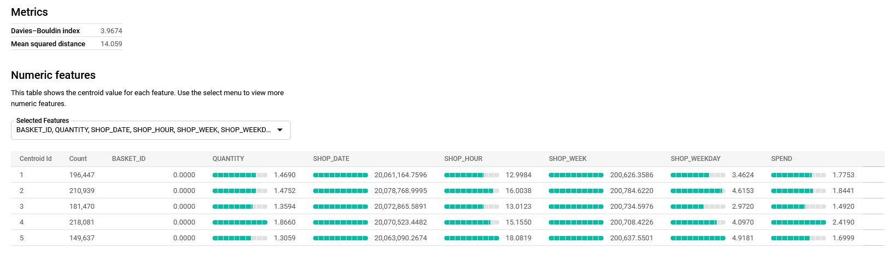
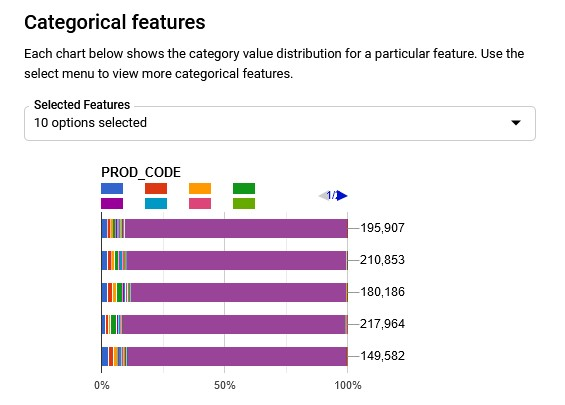
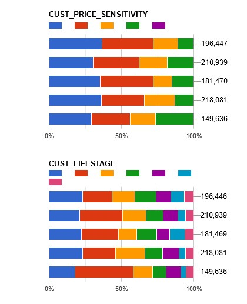
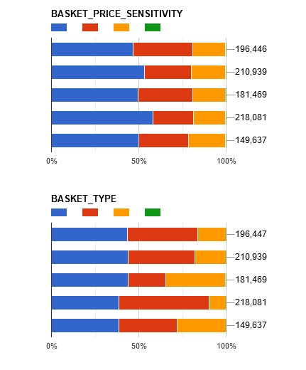

From in class assignment

--SELECT  FROM `bads-customer-analytics.supermarket_class.supermarket` LIMIT 1000

CREATE MODEL`bads-customer-analytics.supermarket_class.clustering_2`
OPTIONS( MODEL_TYPE='KMEANS',NUM_CLUSTERS=5,KMEANS_INIT_METHOD='RANDOM') AS 
SELECT*FROM`bads-customer-analytics.supermarket_class.supermarket`

Initially with all of the times on our hands, we started the Automodel using K-mean with K = 19

 If we zoomed in and use the elbow method, we get the K=3~5  to be approachable in terms of results vs performance dictated by the hard turn in the trend.
  
So now we rerun the query using K=5 on the same dataset
  

The time required looks like it took longer, this is because for the required features, I included all of the columns. However, the results on the evaulation page seems to make more sense than the K = 19 counter part.
 

 
Then once we go down to look at the categorical features, the results were not that surprising as to what column made sense to be used as features and what not.
For example, the product purchased were too bias when using K-Mean
 

 
 Compared this to the Customer Price sensitivity, Lifestage, and Basket size which presented us with a nice clean color distribution.
  

  

  
  In terms of the marketing team, the 3 colors distribution (discard the green and purple) of Basket size looks the most manageable and should be incorporated into existing plan easier than the Customer Lifestage which has 7 segments
  
  
