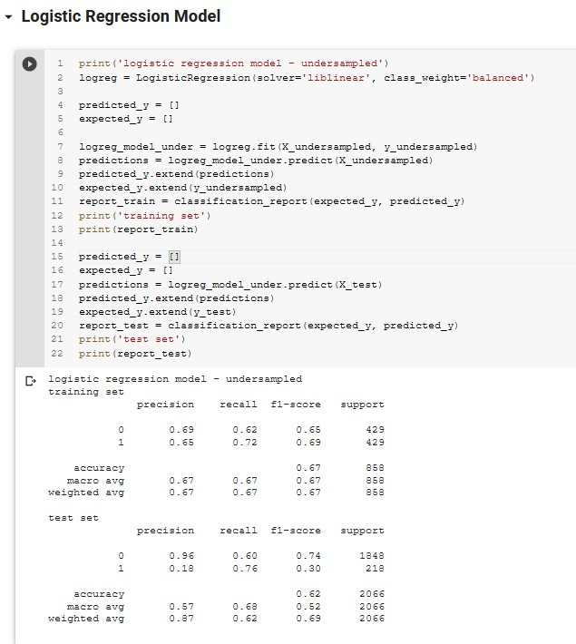
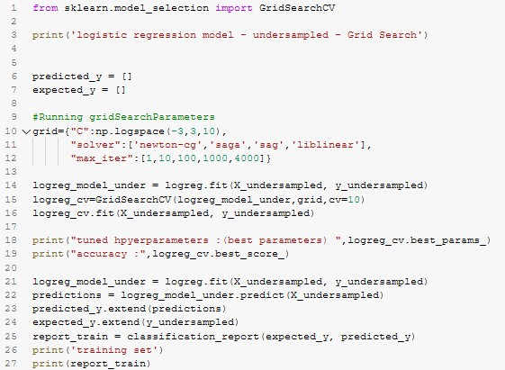
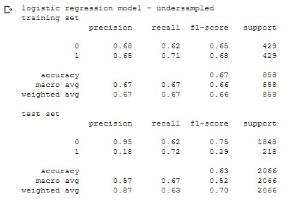

Campaign Response Model

We started out with the basic logistics regression from SkitLearn

To improve upon the model, I choose to use GridSearch method rather than feature engineering. Doing so by calling GridSearchCV.

The f1score on the weighted average and the accuracy were <b>Insignificantly</b> increased. 1%.
  

  
This is true for all the undersample,oversampled version of logistic regression, insignificant increased.
  
To produce better results, we then turn onto the XGBoost model
