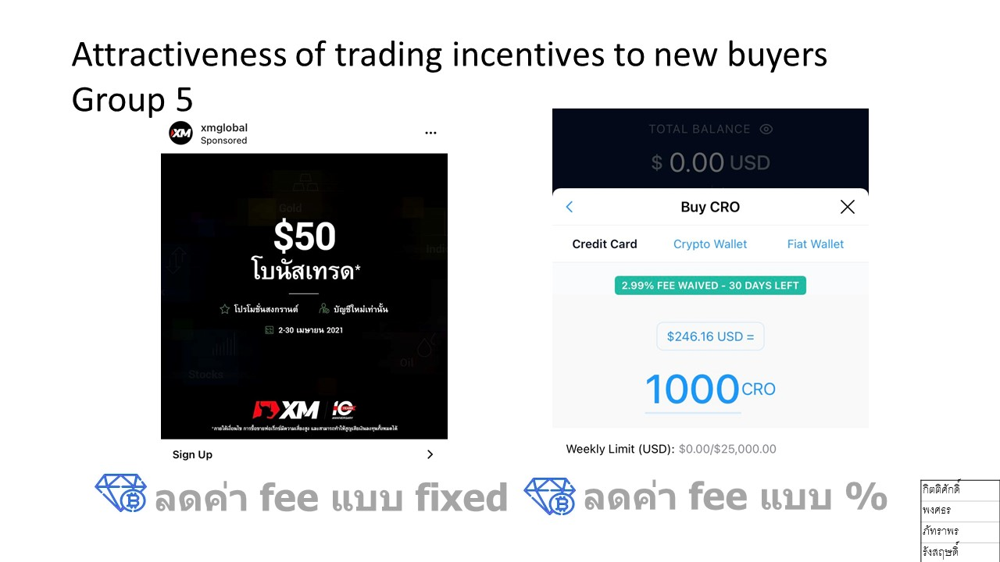
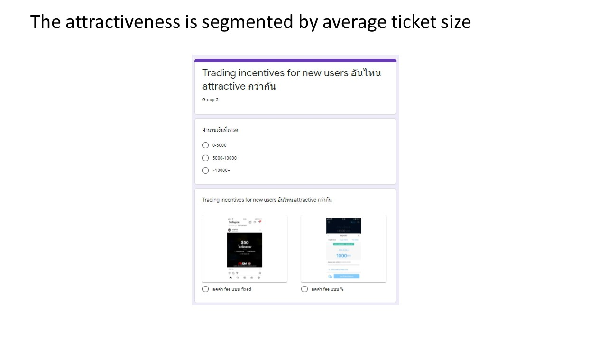
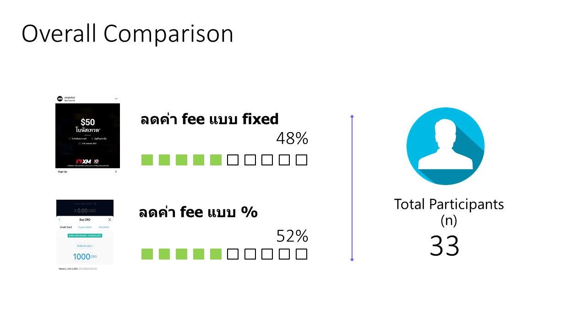
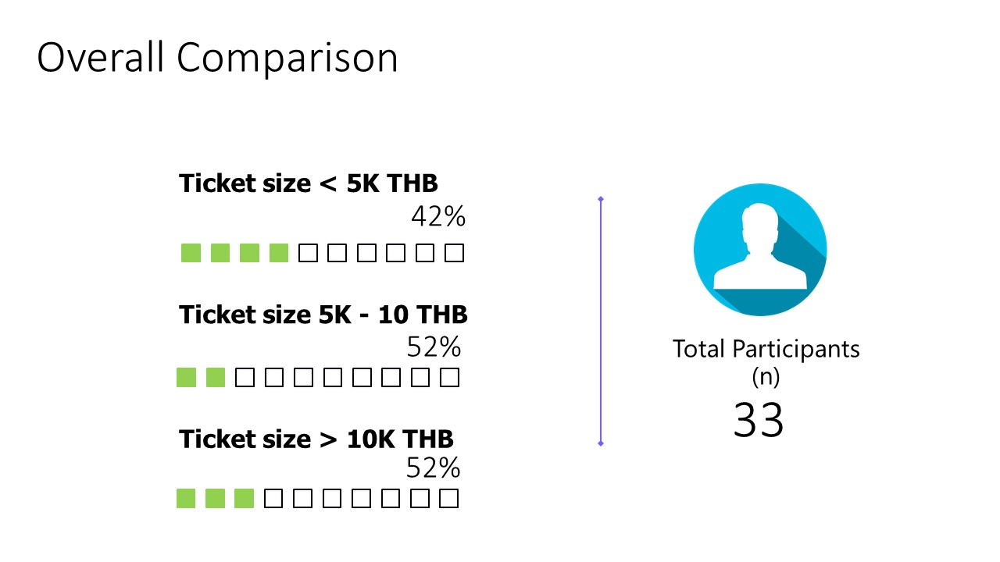
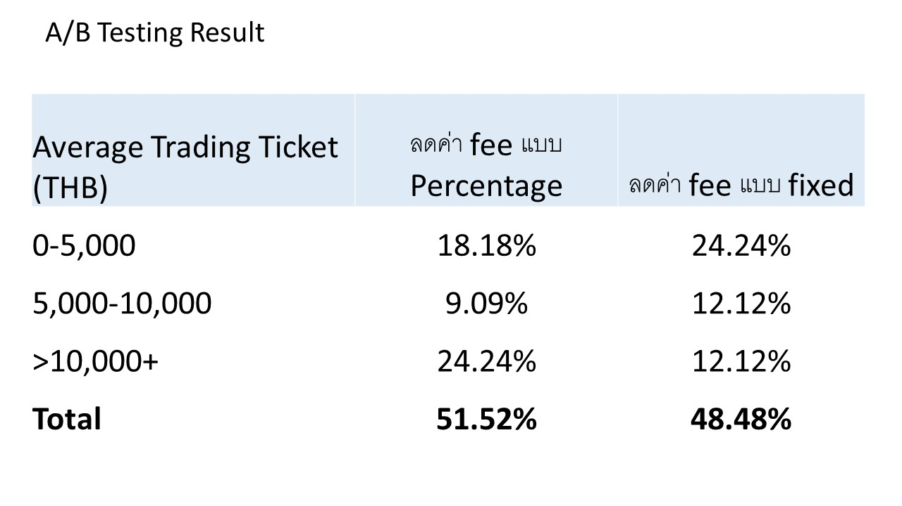

<h1> A/B Testing</h1>

A/B Testing is simply about choosing whether A or B is better at achieving your goals with data to back those claims up.
For today's A/B Testing, our team decided to do the topic on trading incentives. Back then, the cryptocurrencies like Bitcoin and Etheruem were all the rage, and the trading platform such as Binance were letting us choose how do we want to pay our fees. That's how the topic came to be

<h2> The Data Collection</h2>

To get the data quickly and effectively within 45 minutes time, we decided to do a simple survey of just 2 questions.
<ol>
  <li>The average amount you trade on each transaction</li>
  <li>What trading incentives do you prefer between fixed fee or the percentage fee</li>
</ol>

The reason we focus on the new users here was because we assumed, from our own experiences, that if the user has been using the platform to trade for a while, in a bull market, the user will accumulate enough bonus trading fees from the platform and wont care regardless.

<h2> The overall results</h2>

Our results from the 33 respondents shown that the Fixed fee and Percentage based fee are about half-half and that our respondents were distributed nicely when it comes to the answer of the first question regarding the average transaction size

However, the moment we cross-tab these data, the results were quite clear. Those that do higher value transactions on average prefer the percentage based which is to be expected since a 0.1% of a $100,000 dollar will definitely be more than a $50 flat incentives.

This also means that further analysis into the platform usage is needed on the transaction value, transaction count, as well as the break even point of the incentives from the user perspective. A question of when is a 1% of transaction value worth more than $xx provided on flat rate.

